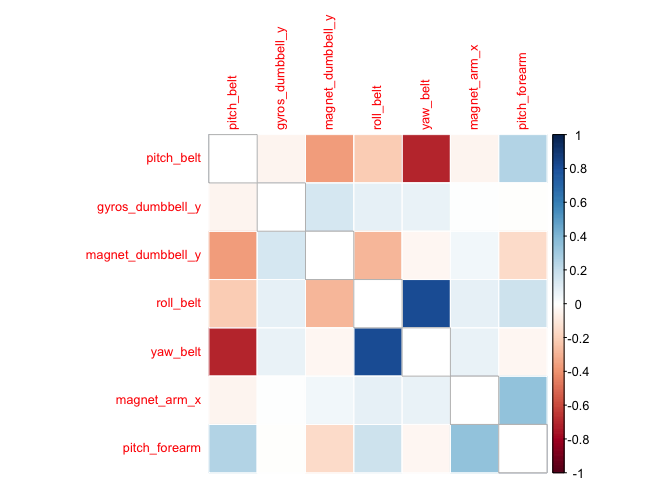
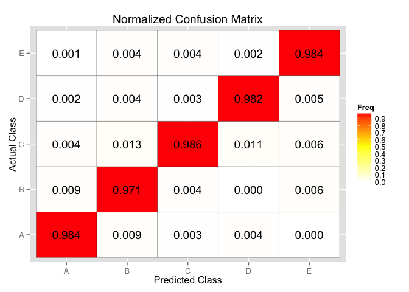

# Practical Machine Learning Course Project
Serena Chung  
March 22, 2016  

##  Practical Machine Learning Prediction Assignment

This is an R Markdown document for Coursera's Practical Machine Learning Prediction Assignment.

### Background

Using devices such as *Jawbone Up*, *Nike FuelBand*, and *Fitbit* it is now possible to collect a large amount of data about personal activity relatively inexpensively. The goal of the project is to quantify how well six participants performed the barbell lifts based on the data collected from accelerometers on the belt, forearm, arm, and dumbell of these participants. More information about the dataset is available from this link: http://groupware.les.inf.puc-rio.br/har and the following publication:

Velloso, E.; Bulling, A.; Gellersen, H.; Ugulino, W.; Fuks, H. Qualitative Activity Recognition of Weight Lifting Exercises. Proceedings of 4th International Conference in Cooperation with SIGCHI (Augmented Human '13) . Stuttgart, Germany: ACM SIGCHI, 2013.

### Data

The training data for this project are available here:

&nbsp;&nbsp; &nbsp;&nbsp; https://d396qusza40orc.cloudfront.net/predmachlearn/pml-training.csv

The test data are available here:

&nbsp;&nbsp;&nbsp;&nbsp; https://d396qusza40orc.cloudfront.net/predmachlearn/pml-testing.csv

The data come this website: http://groupware.les.inf.puc-rio.br/har.


```r
## preliminary requirement
library(ggplot2); library(lattice); library(caret); library(corrplot);
library(randomForest); library(gbm);
set.seed(2345)
```


```r
## Load data, setting #DIV/0!, NA, and empty entries as NA
pml_training <- read.csv('https://d396qusza40orc.cloudfront.net/predmachlearn/pml-training.csv'
                         , na.strings=c("NA","#DIV/0!","") )
pml_testing  <- read.csv('https://d396qusza40orc.cloudfront.net/predmachlearn/pml-testing.csv'
                         , na.strings=c("NA","#DIV/0!","") )
```

Separate the training dataest into two sets so some can be used later for cross validation:

```r
inTrain <- createDataPartition(pml_training$classe,p=0.7,list=FALSE)
myTraining <- pml_training[inTrain,] 
myTesting <- pml_training[-inTrain,] 
```

### Data Exploration Feature Selection

The following remove variables that have no physical meaning with respect to the prediction:  user_name is removed because the assumption is that the prediction should not dependent on knowing who is performing the activities; X is an index and thus not useful for prediction; the time releated variables and num_window are also not useful.  This will reduece the number of variables from 160 to 154.

```r
myTraining <- subset(myTraining,select=-c(X,user_name,raw_timestamp_part_1
                                          ,raw_timestamp_part_2,cvtd_timestamp,num_window
                                          )
                     )
```

To focus on features with good amount of data, remove features with more than 80% of the values being NA:

```r
fNA <- sapply(myTraining, function(x) sum(is.na(x)) /length(x))
myTraining <- myTraining[,fNA<=0.2]
```

Following Velloso et al. (2013), use a correlation based feature selector to select features.
This results in only seven features being selected for building a predictor model.

```r
library(FSelector)
selected <- cfs(classe~.,myTraining)
myTraining<-subset(myTraining,select=c(selected,"classe")) 
names(myTraining)
```

```
## [1] "roll_belt"         "pitch_belt"        "yaw_belt"         
## [4] "magnet_arm_x"      "gyros_dumbbell_y"  "magnet_dumbbell_y"
## [7] "pitch_forearm"     "classe"
```

Below is a plot showing the correlations between all remaining features. The correlation coefficients are all less than 0.9, though some are between 0.7 and 0.83. Keep all of the seven remaining features to be the conservative side.

```r
library(corrplot)
corrMatrix <- cor(myTraining[,-ncol(myTraining)],use="complete")
corrplot.mixed(corrMatrix, lower="color", upper="color"
               ,tl.pos="lt", tl.cex=0.8,tl.srt=90,diag="n", order="hclust"
               ,hclust.method="complete"
               )
```



### Building the Model

Build two predictor models, one using random forest and boosted tree approaches. Use 10-fold cross validation for both approaches.  The accuracies of the two models are compared using the test data set that was set aside earlier. The random forest approach gives more accurate results at 98% vs. 89% accuracy and is chosen as the final model.  

```r
modFitRF <- train(classe~.,data=myTraining,method="rf"
                          ,na.action=na.omit
                          ,trControl=trainControl(method="cv",number=10)
                          )
modFitGBM <- train(classe~.,data=myTraining,method="gbm"
                          ,na.action=na.omit
                          ,trControl=trainControl(method="cv",number=10)
                          )
mRF <- confusionMatrix(myTesting$classe,predict(modFitRF,myTesting))
mGBM <- confusionMatrix(myTesting$classe,predict(modFitGBM,myTesting))
```


```r
print(mRF)
```

```
## Confusion Matrix and Statistics
## 
##           Reference
## Prediction    A    B    C    D    E
##          A 1648   15    6    4    1
##          B   10 1106   15    4    4
##          C    3    4 1012    3    4
##          D    4    0   11  947    2
##          E    0    6    6    5 1065
## 
## Overall Statistics
##                                           
##                Accuracy : 0.9818          
##                  95% CI : (0.9781, 0.9851)
##     No Information Rate : 0.2829          
##     P-Value [Acc > NIR] : < 2e-16         
##                                           
##                   Kappa : 0.977           
##  Mcnemar's Test P-Value : 0.02901         
## 
## Statistics by Class:
## 
##                      Class: A Class: B Class: C Class: D Class: E
## Sensitivity            0.9898   0.9779   0.9638   0.9834   0.9898
## Specificity            0.9938   0.9931   0.9971   0.9965   0.9965
## Pos Pred Value         0.9845   0.9710   0.9864   0.9824   0.9843
## Neg Pred Value         0.9960   0.9947   0.9922   0.9967   0.9977
## Prevalence             0.2829   0.1922   0.1784   0.1636   0.1828
## Detection Rate         0.2800   0.1879   0.1720   0.1609   0.1810
## Detection Prevalence   0.2845   0.1935   0.1743   0.1638   0.1839
## Balanced Accuracy      0.9918   0.9855   0.9805   0.9900   0.9931
```

The overall expected out of sample error is 1.8% as indicated by the above confusion matrix output when tested against the test set.  Below is a plot of the normalized confusion matrix.  The accuracy is 97% or greater for all classifications. 

```r
tRF <- mRF$table
tRFnormalized <- tRF/rowSums(tRF)
dfRFnormalized <- as.data.frame(tRFnormalized)
p <- ggplot(dfRFnormalized, aes(x = Prediction, y = Reference, fill = Freq)) +
    geom_tile(colour="black")+
    scale_fill_gradientn(breaks=seq(from=0, to=1, by=.1),colours=c("white","yellow","red")) +
    geom_text(aes(fill = dfRFnormalized$Freq, label = sprintf("%5.3f",dfRFnormalized$Freq)))+
    scale_x_discrete(name="Predicted Class") +
    scale_y_discrete(name="Actual Class") +
    ggtitle("Normalized Confusion Matrix")
show(p)
```



